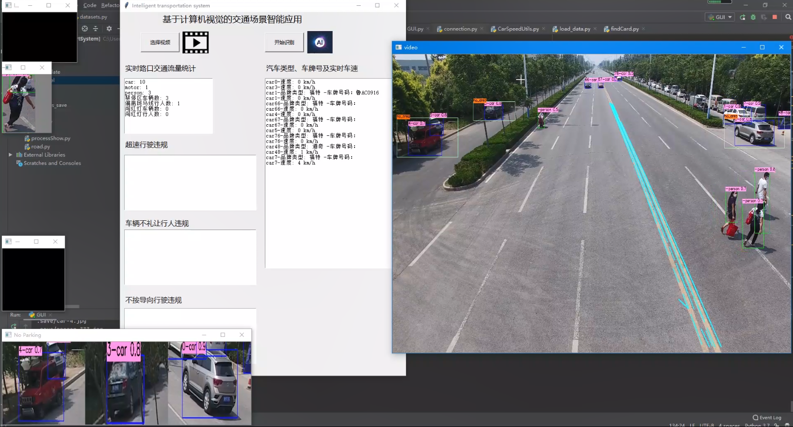
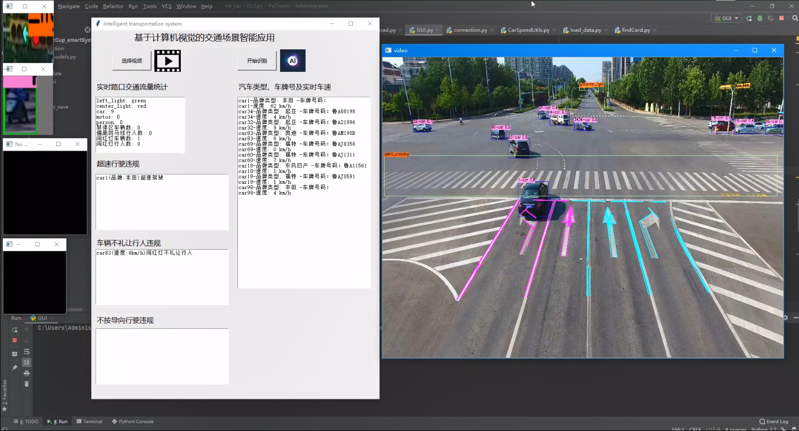
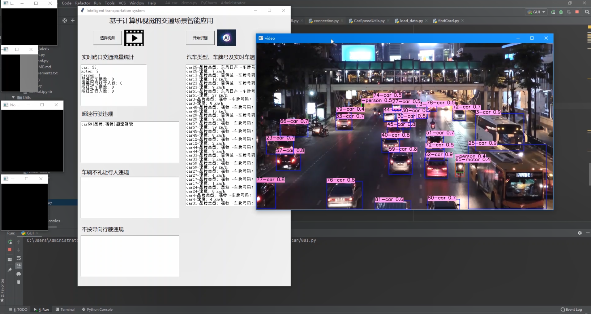
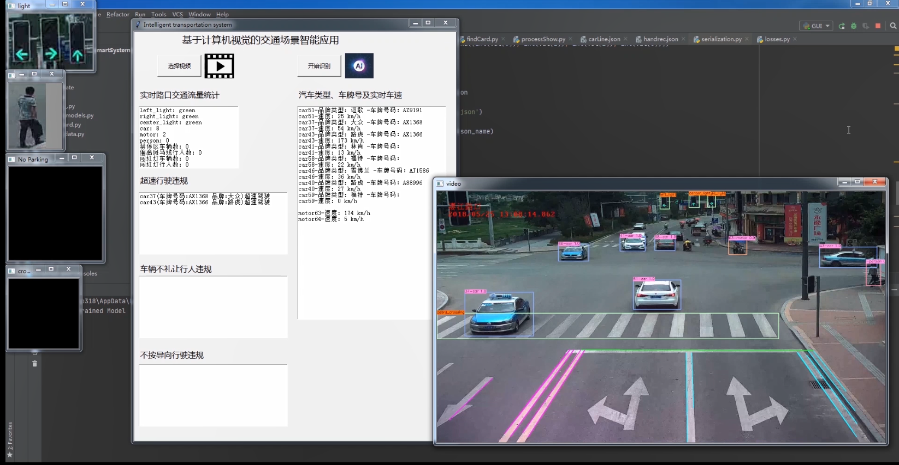

# 基于计算机视觉的交通场景智能应用 
第九届中国软件杯大赛-A组赛题, 对公共交通路口摄像头类似视角的交通场景进行检测识别

## 1. 运行所需环境、相关库，以及配置

1. Python版本要求：3.7

2. 特殊第三方库版本要求: torch-1.2.0版本和torchvision-0.4.0版本

3. 其他第三方库版本要求: opencv_python,albumentations,imutils

## 2. 使用流程

1. 运行GUI.py启动项目
```bash
python GUI.py
```

2. 点击“选择视频”按钮，选择项目下Videos文件夹下的测试视频。

3. 点击“开始识别”按钮。

## 3. 界面









## 主要文件夹说明
- Classification: 识别红绿灯的分类网络
- LicensePlate: 车牌识别
- theyolo: 目标检测算法
- Utils: 车道线、车速等检测识别方法的工具函数

<!-- [source](https://github.com/diadestiny/Intelligent-application-of-traffic-monitoring-scene) -->
